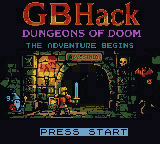
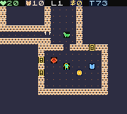

# GBHack

A roguelike dungeon crawler for the Game Boy Color, inspired by NetHack. Written
in C using GBDK (Game Boy Development Kit) and generated with
[Claude Code](https://claude.ai/code).

<p>
  
  
</p>

## Overview

GBHack adapts the core loop of NetHack to the constraints of the Game Boy Color:
procedurally generated dungeons, permadeath, unidentified items, hunger
mechanics, pets, shops, and the Amulet of Yendor as the ultimate goal. The game
runs on original GBC hardware as well as any accurate emulator.

## Building

### Prerequisites

Download the [GBDK](https://github.com/gbdk-2020/gbdk-2020) toolchain and
extract it so that a `gbdk/` directory sits alongside the `gbhack/` project
directory (i.e. `../gbdk/` relative to this repo root). The Makefile expects to
find `bin/lcc` and `bin/png2asset` inside that directory.

Tested with GBDK 4.3.0 on macOS (ARM64). Other platforms supported by GBDK
should work with no changes.

### Build

```
make
```

This produces `build/gbhack.gbc`, a 256 KB ROM suitable for any Game Boy Color
emulator or flash cart. The ROM uses MBC5 with battery-backed SRAM (32 KB across
4 banks).

### Run

```
make run
```

Opens the ROM in [SameBoy](https://sameboy.github.io/) on macOS. Substitute
your preferred emulator if needed.

### Clean

```
make clean
```

## Gameplay

You descend through 15 procedurally generated dungeon levels. Each level
contains rooms connected by corridors, with doors, traps, fountains, altars, and
shops scattered throughout. Your goal is to reach the bottom, retrieve the Amulet
of Yendor, and escape back to the surface.

### Controls

| Button | Action |
|--------|--------|
| D-pad | Move (8 directions with diagonals via B+D-pad) |
| A | Action menu (eat, quaff, read, zap, pick up, drop, wait, save) |
| B | Context action (pick up item on ground, or rest) |
| START | Character sheet |
| SELECT | System menu (sound toggle, help, save and quit) |

### Features

- 15 dungeon levels with increasing difficulty
- 8 monster types with distinct AI behaviors (aggressive, passive, erratic, wandering, fleeing)
- Monster special abilities: poison, paralysis, teleportation, theft, drain, petrification
- Items across 9 categories: weapons, armor, potions, scrolls, wands, food, gold, tools, amulets
- Unidentified item appearances that shuffle each game
- BUC (blessed/uncursed/cursed) item status
- Pet companion (cat or dog) with loyalty and feral mechanics
- Shopkeepers who track debt and turn hostile if you steal
- Hunger system with six states from satiated to starved
- Permadeath with bones files (encounter your previous character's remains)
- Battery-backed save with auto-save every 50 turns
- High score tracking across runs
- Six music tracks and 13 sound effects

## Architecture

### Memory Layout

The Game Boy Color has 32 KB of address space with bank switching. GBHack uses
16 ROM banks (256 KB total) and 4 SRAM banks (32 KB) via the MBC5 mapper:

| Bank | Contents |
|------|----------|
| ROM 0 | Main loop, input, RNG, sound driver, player, UI |
| ROM 2 | Renderer, tileset data |
| ROM 3 | Dungeon generator, field of view |
| ROM 4 | Monster AI, pet system |
| ROM 5 | Inventory, shop |
| ROM 6 | Item logic, save/load |
| ROM 7 | Title screen background image |
| ROM 8 | Music data (title, dungeon, death, victory) |
| ROM 9 | Music data (boss theme) |
| SRAM 0 | Save data (dungeon map, player state, entity state) |

Bank assignments are managed in the Makefile via SDCC's `-Wf-bo` flag. Functions
in banked code are declared with the `BANKED` keyword, which generates far-call
trampolines automatically.

### Source Organization

```
src/
  main.c          Game state machine, intro/title/game over screens
  common.h        Shared types, constants, macros (Room, Monster, Item, Player)
  dungeon.c/h     BSP-based room generation, corridor carving, door placement
  render.c/h      Viewport camera, tile rendering, palette management, VFX
  fov.c/h         Shadowcasting field of view (1200-bit visibility bitmap)
  player.c/h      Stats, movement, combat, hunger, leveling
  monsters.c/h    Spawn tables, AI dispatch, melee combat, special abilities
  monsters_data.c ROM-resident monster type definitions
  items.c/h       Item type system, randomized appearances, floor item tracking
  items_data.c    ROM-resident item type definitions
  inventory.c/h   Inventory management, equip/use/drop logic
  shop.c/h        Shop room detection, pricing, debt tracking, theft
  pet.c/h         Pet companion AI, loyalty, feeding, feral transition
  save.c/h        SRAM save/load with magic-number validation, bones files
  save_data.c     SRAM-resident save buffer (pinned to SRAM bank 0)
  ui.c/h          Text rendering, menus, message log, prompts
  input.c/h       Joypad polling with press/hold detection
  rng.c/h         16-bit xorshift PRNG seeded from hardware divider
  sound.c/h       hUGEDriver music playback, CBT-FX sound effects
  music/          Compiled music data (hUGE format tracker output)
res/
  tiles.c/h       Gameplay tileset (terrain, entities, UI glyphs)
  title_bg.c/h    Title screen background image (GBC format with palettes)
  title_bg.png    Source PNG for the title screen
  tile_quantize.py   Color quantization tool for GBC tile constraints
  kenney_to_gb.py    Converter for Kenney sprite sheets to GB 2bpp format
lib/
  hUGEDriver.h/lib   Music playback driver for hUGE tracker format
  cbtfx.c/h          CBT-FX sound effect engine
```

### Technical Decisions

**Language**: C via SDCC (Small Device C Compiler) through GBDK. The SM83 CPU
in the Game Boy is an 8-bit processor with a 16-bit address bus and no hardware
multiply or divide. All game logic uses fixed-point integer arithmetic with
uint8_t and uint16_t types.

**Dungeon generation**: Rooms are placed with random positions and sizes (up to
8 per level), then connected with L-shaped corridors. Special room types (shops,
altar rooms) are assigned probabilistically based on dungeon depth. The generator
runs in ROM bank 3 alongside FOV to keep bank 0 small enough for the core loop.

**Field of view**: A bitpacked visibility array (150 bytes for 40x30 map)
tracks which cells the player can currently see. Shadowcasting runs each time
the player moves, marking cells as visible or not. Previously seen cells are
rendered dimmed; unseen cells are black.

**Rendering**: The GBC background layer displays a 20x15 viewport into the
40x30 map. The camera follows the player with clamping at map edges. Tiles are
rendered using VRAM bank 0 for tile data and bank 1 for attribute maps
(palette assignment, flip flags). The status bar uses the GBC window layer. A
full redraw writes 300 tiles; incremental updates minimize VRAM writes per
frame.

**Sound**: Music uses [hUGEDriver](https://github.com/SuperDisk/hUGEDriver),
a tracker-based playback engine that runs from the VBlank interrupt handler.
Sound effects use [CBT-FX](https://github.com/datmobiledev/cbtfx), which
temporarily takes over audio channels for short one-shot effects. The two
systems coexist by restoring music channel state after each SFX completes.

**Save system**: Game state is serialized to battery-backed SRAM with a magic
number for validation. The dungeon map (1200 bytes), player struct, monster
array, floor items, and inventory are packed across SRAM banks. Bones files
preserve a dead character's dungeon level and items so future runs can encounter
them. Auto-save runs every 50 turns; the save is deleted on death (permadeath).

**Item identification**: Following NetHack tradition, potions, scrolls, and
wands have randomized appearance names that shuffle each new game. Players must
use items or find scrolls of identify to learn what they do. The BUC
(blessed/uncursed/cursed) system adds another layer of uncertainty.

**RNG**: A 16-bit xorshift generator seeded from the Game Boy's hardware
divider register. Additional entropy is mixed in after the player presses START
on the title screen, using the timing of human input to decorrelate runs.

### Art Direction

The tileset draws from [Kenney's](https://kenney.nl/) micro-roguelike and 1-bit
pixel art packs, converted to Game Boy Color's 2bpp (4 colors per tile) format
using custom Python tooling. Each 8x8 tile uses two bitplanes to encode four
shades, mapped to GBC palettes with up to 8 palettes of 4 colors each on
screen simultaneously.

The visual style aims for readability on the GBC's 160x144 display. Terrain
uses muted earth tones, monsters and items use distinct palette assignments for
quick identification (hostile monsters in reds, consumable items in greens,
equipment in blues), and the UI palette reserves high-contrast white-on-dark for
text.

The title screen background was created as a full-color image, then processed
through a custom tile-aware color quantization pipeline (`tile_quantize.py`)
that enforces the GBC's hardware constraints: a maximum of 4 colors per 8x8
tile region and 8 palettes globally.

## Development Process

GBHack was developed iteratively over multiple sessions using Claude Code as the
primary development tool. The workflow was conversational: describing desired
features, reviewing generated code, testing in emulators (SameBoy and Gearboy
with MCP debugging), and refining based on observed behavior.

The project started from a blank GBDK template and grew system by system. The
dungeon generator came first, then rendering, then player movement, then
monsters, items, and UI. Each system was developed and tested in isolation before
integration. Bank overflow was the most recurring constraint, requiring code to
be split across ROM banks whenever bank 0 exceeded its 16 KB limit.

Tile art was adapted from Kenney's CC0 asset packs using Python scripts that
read PNG files (without any image library dependencies, using only stdlib struct
and zlib) and convert them to the Game Boy's native 2bpp tile format. Several
rounds of manual iteration refined the palette choices and tile designs to work
within the severe color and resolution constraints.

Music was composed by Beatscribe and Yoki (Trominal) in hUGE tracker format and
compiled to C data arrays for inclusion in the ROM. Integrating the music driver
with the sound effect engine required careful channel management to avoid audio
glitches when both systems access the same hardware registers.

## Credits

- Code by [@statico](https://github.com/statico) and
  [Claude Code](https://claude.ai/code)
- Based on [NetHack](https://nethack.org/)
- Music by [Beatscribe](https://www.beatscribe.com/) and Yoki
  ([Trominal](https://trominal.itch.io/))
- Art by [Kenney](https://kenney.nl/) (CC0)
- Built with [GBDK](https://github.com/gbdk-2020/gbdk-2020),
  [hUGEDriver](https://github.com/SuperDisk/hUGEDriver), and
  [CBT-FX](https://github.com/datmobiledev/cbtfx)

## License

The source code in this repository is released under the MIT License. See
[LICENSE](LICENSE) for details.

Art assets from Kenney are licensed under
[CC0 1.0 Universal](https://creativecommons.org/publicdomain/zero/1.0/). Music
tracks should be credited per their original license terms.
